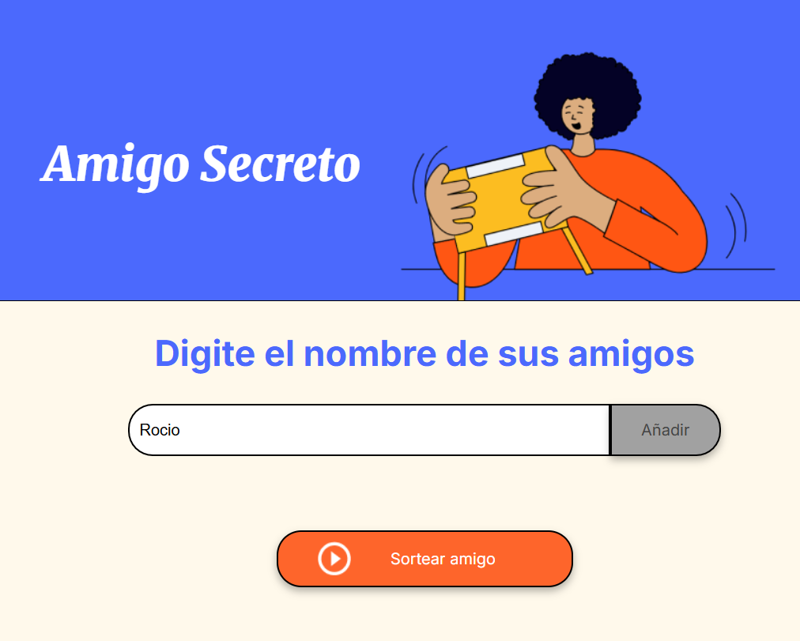
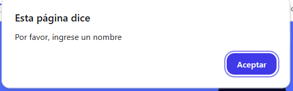
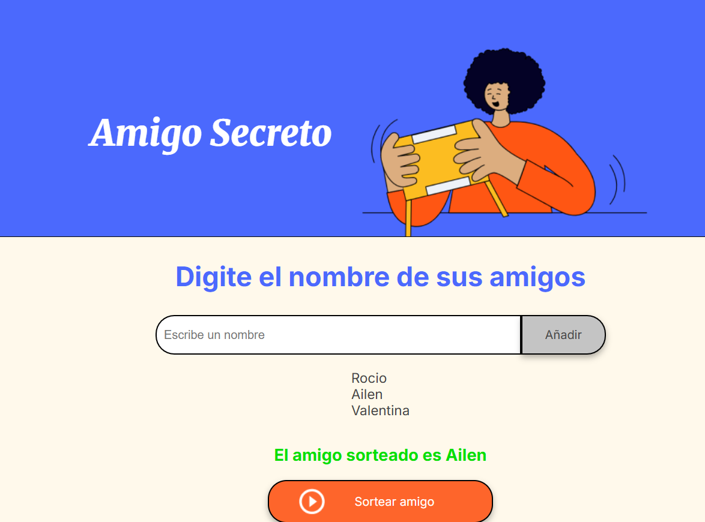
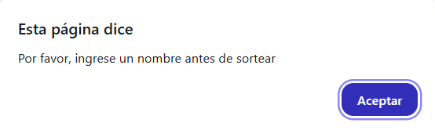

# Challenge-Amigo-Secreto
Esta aplicación es un proyecto parte del curso de Formación Principiante en Programación del programa ONE de Alura LATAM.

## Sobre la aplicación
Consiste en una app que permite a los usuarios ingresar nombres de amigos, los cuales se agregan en una lista visible, realizar un sorteo aleatorio entre los nombres ingresados y sortear entre ellos quién es el "Amigo Secreto". 

Para usar la aplicación los usuarios deben agregar nombres a través de un campo de texto y un botón "Añadir", visualizar la lista de nombres y, luego, clickear en "Sortear Amigo" para que se determine un nombre de forma aleatoria, mostrando el resultado en pantalla. El programa mostrará una alerta en caso de que el campo esté vacio al momento de seleccionar "Añadir" o la lista esté vacía al hacer click en "Sortear amigo".

## Código construido con
-**HTML**.
-**Javascript**.
-**CSS**.

## Funcionalidades de la aplicación
-🖊️**Agregar nombres:** Los usuarios pueden ingresar los nombres a través de un campo de texto y el botón **Añadir**.

   
   
-❗**Validación nombre:** Si el campo de texto está vacío al momento de hacer click en **Añadir**, el sistema mostrará una alerta solicitando la inserción de un nombre.

   
   
-👁️**Visualización de lista** Los usuarios pueden visualizar la lista de los nombres ingresados para ser sorteados automáticamente al seleccionar el botón **Añadir**.

   
   
-🎲**Selección aleatoria** Al hacer click en el botón **Sortear Amigo** sistema seleccionará aleatoriamente un nombre de la lista y lo mostrará en pantalla.

   
   
-❗**Validación amigos:** Si no hay elementos (nombres) en la lista al momento de hacer click en **Sortear amigo**, el sistema mostrará una alerta solicitando la inserción de nombres de amigos.

   

## INSTALACION
### Pasos:
1. Clonar el repositorio en tu equipo local
    ```bash
    git clone https://github.com/rociobah/Challenge-Amigo-Secreto.git
    ```

2. Navega el directorio del proyecto:
    ```bash
    cd challenge_amigo_secreto-main
    ```

3. Abre el archivo index.html

4. **¡Ya puedes comenzar a utilizar la aplicación!**
